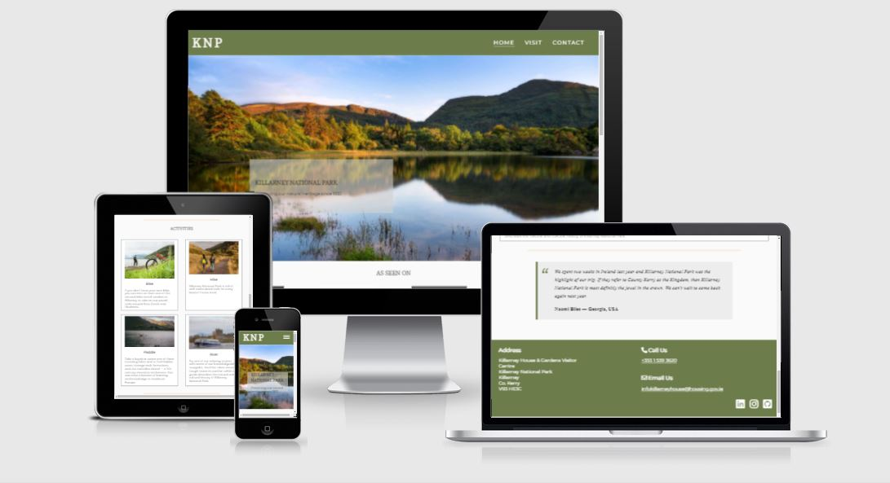

# Killarney National Park

Travel and information website for one of Ireland's most famous destinations.

Take a Look [Here](https://greengraf.github.io/killarney-national-park/)

 

## Portfolio Project 1

Situated in the south west of the island, Killarney National Park is one of the most biodiverse places in Ireland, and is a popular destination for tourists and locals alike. As well as possessing varied and breathtaking scenery, the park has major historical significance too. Not only was it the first national park in Ireland but it is also home to a beautiful example of Victorian architecture in the form of Muckross House and Gardens, complete with a working traditional farm. 

### Purpose

Because there is so much to see and do in the park, visitors can be overwhelmed choice. The aim of this website is to clearly outline the best areas to visit, the ways in which the park can be traversed, and, through a contact form, act as a way of getting in touch with the park staff should anyone have any questions.

 

Strategy = Site Owner Goals, and add User Stories
Scope = What features you have planned
Structure = What pages you want, and what will be in them
Skeleton = Wireframe
Surface = Visuals/Colours/etc

## User Experience Design

### Strategy 

## Existing Features

* Navigation Bar
    * The navigation bar is on all three pages. On smaller screens it collapses into a hamburger menu. This was achieved through pure CSS. The CSS was found on [THIS](https://dev.to/ljcdev/hamburger-css-no-js-2dfa) website 