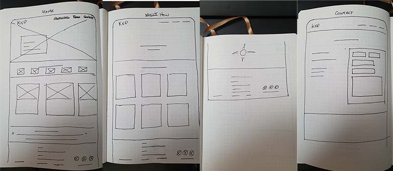
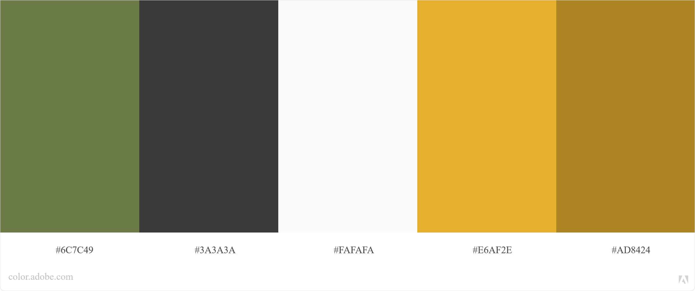
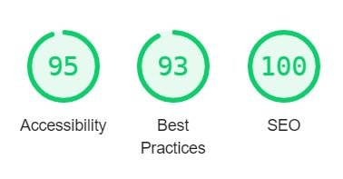
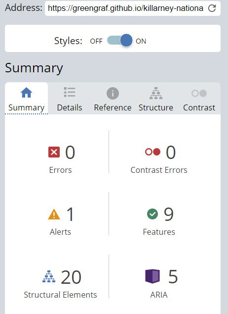

# Killarney National Park

Travel and information website for one of Ireland's most famous destinations.

Take a Look [Here](https://greengraf.github.io/killarney-national-park/)

 

## Portfolio Project 1

Situated in the south west of the island, Killarney National Park is one of the most biodiverse places in Ireland, and is a popular destination for tourists and locals alike. As well as possessing varied and breathtaking scenery, the park has major historical significance too. Not only was it the first national park in Ireland but it is also home to a beautiful example of Victorian architecture in the form of Muckross House and Gardens, complete with a working traditional farm. 

### Purpose

Because there is so much to see and do in the park, visitors can be overwhelmed choice. The aim of this website is to clearly outline the best areas to visit, the ways in which the park can be traversed, and, through a contact form, act as a way of getting in touch with the park staff should anyone have any questions.

  

## User Experience Design

### Strategy 

#### User Stories

* As a website visitor I want to:
    * Intuatively know what the website is for.
    * Easily find more information about the website.

* As a potential customer I want to:
    * Be convinced that this is a worthwhile place to visit.
    * Trust the organisation that runs it.
    * Find out about areas of interest in the park.
    * Know how I can travel through the park.

* As someone who is already interested in going here I want to:
    * Know how to get there.
    * Get in touch to ask about specific locations.

* As a website developer I want to:
    * Create a website that has an intuative structure.
    * Make a website that is enjoyable to navigate.
    * Fulfill the brief from the stakeholder, and exceed expectations. 

### Scope

#### What features are planned
* The website must draw potential visitors with descriptive, warm, and engaging copy.
* High-quality images are extremely important in any travel website. The park must come across as a "must-see" attraction.
* Potential visitors must have a way of easilly getting in touch with the park.
* Visitors should be able to easily find where the park is, and understand the limited office opening hours so as not to expect 24hr customer service (this is a public service)
#### Structure
* Three pages:
    * Home page
    * A 'Visit' page for Information on areas of interest
    * Contact page
#### Skeleton 
  

#### Surface
The idea behind the aesthetic of the website is to convey friendliness, a sense of adventure, and a connection with nature in modern times.

##### Color Theme

* The primary color, #6C7C49, is a soft, warmish green. It's meant to wrap around the site, as if the user is immersed in the park.
* The secondary color, #E6AF2E, is a bright gold, which is meant to compliment the green and represents the beautiful light that can be experienced in the park but aslo mimics the color of the wild grasses in the autumn and winter.
* The main font color is #3A3A3A. It's a slate grey as opposed to a black. Pure black is an unnatural color and can be quite disconcerting. The slate grey is easier on the eyes.
* #FAFAFA is the chosen color for the background of the website. It's softer than pure white so it's easier on the eyes. 
* Finally, a tertiary color, #AD8424, will be adopted in certain areas to improve accessibility  

##### Typography

The site will have a serif font, called Source Serif Pro, for titles and headings. It is a font that is similar to Courier but has a slightly friendlier curvature to it. It's a nod to the style employed by North American national parks — hence, representing 'Adventure.'  

To pair with the serif font, the site will use a more modern looking sans-serif font for paragraphs. Montserrat is the chosen font here. 

## Existing Features

* Navigation Bar

    * The navigation bar is on all three pages. On smaller screens, it collapses into a hamburger menu. This was achieved through pure CSS. The CSS was found on [here](https://dev.to/ljcdev/hamburger-css-no-js-2dfa) and copied. It has been edited to suit the design of this website.
    * The navigation bar has links to the homepage, visit page, and contact page. The logo, KNP, also acts as a homepage button.

 

* Hero Section
    * The hero section, with its striking image and cover text, is designed to immediately get the attention of the user and briefly describe the function of the website.

 

 

* Social Proof
    * The purpose of this section is to instill trust in KNP. Having mainstream brands, who feature and rate KNP highly, makes KNP aspirational and will confirm to the user that it's a reliable and popular location. 
    * Positioning it directly beneath the hero section will quickly negate any hesitation the user might have, and convince them to explore the website further.

* Activities Section

    * This section is designed to showcase what you can do in the park with images and text. 

   

 

* Quote Section
    * The aim of the quote section is to create an emotional response and connection with the user.
    * Having an original voice of a previous visitor gives the site more authenticity.
    * It could make it easier for the user to imagine themselves there.

  

* Footer 
    * The footer section — which is on every page — acts as a consistant area that gives the most important information for getting in touch with the park.
    * This section also has social media icons so users can keep up with all that's going on at the park.

 

* Visit Us Section
    * This section describes some of the key attractions at the park.
    * High-quality images suppliment the descriptive text, in order to whet the users appitite for visiting the park. 

 

* Contact Page
    * The sole purpose of this page is to allow the user to easilly get in touch with the park.
    * The user will need to enter a first name, email, and message to trigger a positive response from the submit button. The user is not required to enter their second name, but can do so if they choose.

### Features Left to Implement 
* Seperate pages for the most significant parts of the park which describes them in further detail.
* Maps of park trails that visitors can take whe they get there. 

## Testing

The website was deployed and tested on the most common screen sizes, down to 320px. As I was testing it, I noticed positioning errors here and there, but the vast majority of them have been fixed. The only areas where there are still issues are on the contact page, where the contents of the contact form appear to be offset to the right of the form. Unfortunately, I didn't have time to fix this but I will attempt to fix it at a later date. Apart from that, the only other responsiveness issue that I came across was the line height spacing in the footer, between the "Email Us" section and the "Call Us" section. This only occurs on the Visit page and the Contact page. It does not occur on the Index page. I'm not sure why this is happening but I didn't have time to figure it out. Again, I will attempt to remedy this at a later date.

Thankfully, after a lot of back and forth, I managed to get the hamburger menu working — styled and positioned appropriately. It also appears at an appropriate break-point, as expected.

### Validator Testing

* HTML
    * No errors occured after auditing every page with the official [W3C Validator](https://validator.w3.org/nu/?doc=https%3A%2F%2Fgreengraf.github.io%2Fkillarney-national-park%2Findex.html)
* CSS
    * No errors occured after auditing every page with the official [(Jigsaw) Validator](https://jigsaw.w3.org/css-validator/validator?uri=https%3A%2F%2Fgreengraf.github.io%2Fkillarney-national-park%2Findex.html&profile=css3svg&usermedium=all&warning=1&vextwarning=&lang=en)

* Lighthouse — Dev Tools
    * I used Lighthouse to test my sites accessability and it received a very good score on desktop and mobile.
    * I also tested the site with [WAVE](https://wave.webaim.org/) and found some accessibility alerts which I easilly fixed.

 

   

## Deployment

* The site was deployed to GitHub pages. The steps to deploy are as follows:
    * In the GitHub repository, navigate to the Settings tab
    * From the source section drop-down menu, select the Master Branch
    * Once the master branch has been selected, the page will be automatically refreshed with a detailed ribbon display to indicate the successful deployment.

There is a link to the live site at the begining of this README.md but for convienience I'll paste the full link here: https://greengraf.github.io/killarney-national-park/

## Credits

I like to say a massive "Thank You" to my mentor, Ben Kavanagh. He's a fantastic motivator and extremely helpful. Also a big thanks to all the helpful people in the Slack community!

### Content

* The icons used in the footer are from [Font Awesome](https://fontawesome.com/)
* The favicon was generated using [Favicon.io](https://favicon.io/favicon-generator/)
* The hamburger menu was created originally by https://dev.to/ljcdev/hamburger-css-no-js-2dfa
* The navbar styles were helped by this YouTube video: https://www.youtube.com/watch?v=W-nIX17Gg-Q&t=97s&ab_channel=AngelaDelise
* The code for the block quote was taken from here: https://codepen.io/cliftwalker/pen/XJaEXY
* This post on Stack Overflow helped me with responsiveness: https://stackoverflow.com/questions/61150660/how-to-make-image-responsive-in-flexbox-with-set-width
* My inspiration for the footer came from this design: https://www.awwwards.com/inspiration/niarra-travel-footer

### Media

* The photos of the bike were the kayak were downloaded from [Pexels](https://www.pexels.com/) from [Daniel Frank](https://www.pexels.com/@fr3nks?utm_content=attributionCopyText&utm_medium=referral&utm_source=pexels) and [Lisa Fotios](https://www.pexels.com/@fotios-photos?utm_content=attributionCopyText&utm_medium=referral&utm_source=pexels) respectively
* The image of the boat was taken from here: https://www.google.com/url?sa=i&url=https%3A%2F%2Fwww.viator.com%2Fen-IE%2Ftours%2FKillarney%2FBOAT-ON-LAKES-OF-KILLARNEY-AND-NATIONAL-PARK%2Fd911-3544P7&psig=AOvVaw1iZN_W6uHkQmhLBgvlhkD4&ust=1642785295412000&source=images&cd=vfe&ved=0CAsQjRxqFwoTCKjUk6nqwPUCFQAAAAAdAAAAABAI
* All other images used are my own.

