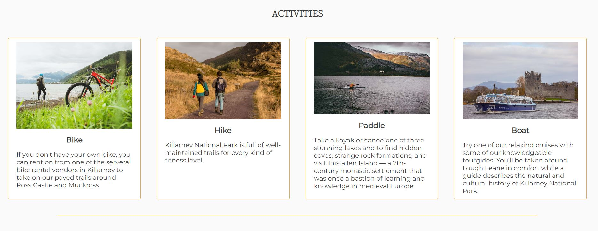

# Killarney National Park

Travel and information website for one of Ireland's most famous destinations.

Take a Look [Here](https://greengraf.github.io/killarney-national-park/)

 

## Portfolio Project 1

Situated in the south west of the island, Killarney National Park is one of the most biodiverse places in Ireland, and is a popular destination for tourists and locals alike. As well as possessing varied and breathtaking scenery, the park has major historical significance too. Not only was it the first national park in Ireland but it is also home to a beautiful example of Victorian architecture in the form of Muckross House and Gardens, complete with a working traditional farm. 

### Purpose

Because there is so much to see and do in the park, visitors can be overwhelmed choice. The aim of this website is to clearly outline the best areas to visit, the ways in which the park can be traversed, and, through a contact form, act as a way of getting in touch with the park staff should anyone have any questions.

  

## User Experience Design

### Strategy 

## Existing Features

* Navigation Bar

    * The navigation bar is on all three pages. On smaller screens, it collapses into a hamburger menu. This was achieved through pure CSS. The CSS was found on [here](https://dev.to/ljcdev/hamburger-css-no-js-2dfa) and copied. It has been edited to suit the design of this website.
    * The navigation bar has links to the homepage, visit page, and contact page. The logo, KNP, also acts as a homepage button.

 

* Hero Section
    * The hero section, with its striking image and cover text, is designed to immediately get the attention of the user and briefly describe the function of the website.

 

 

* Social Proof
    * The purpose of this section is to instill trust in KNP. Having mainstream brands, who feature and rate KNP highly, makes KNP aspirational and will confirm to the user that it's a reliable and popular location. 
    * Positioning it directly beneath the hero section will quickly negate any hesitation the user might have, and convince them to explore the website further.

* Activities Section

    * This section is designed to showcase what you can do in the park with images and text. 

   

 

* Quote Section
    * The aim of the quote section is to create an emotional response and connection with the user.
    * Having an original voice of a previous visitor gives the site more authenticity.
    * It could make it easier for the user to imagine themselves there.

  
